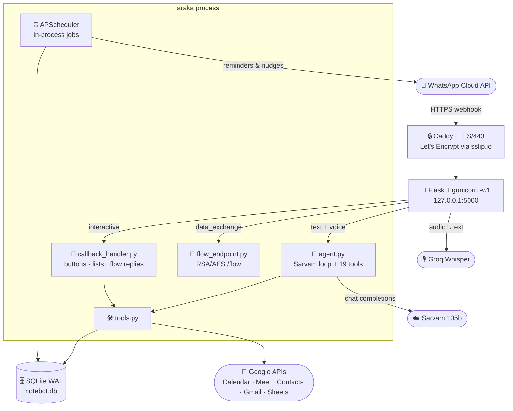
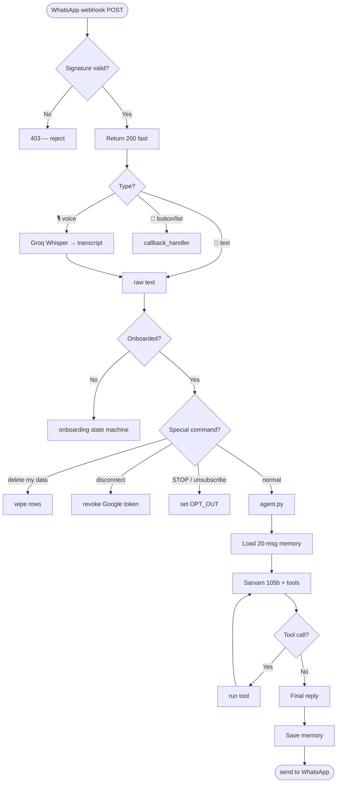
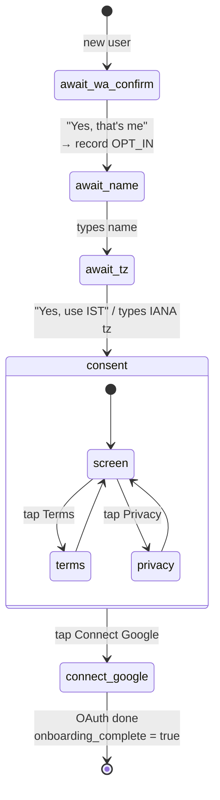
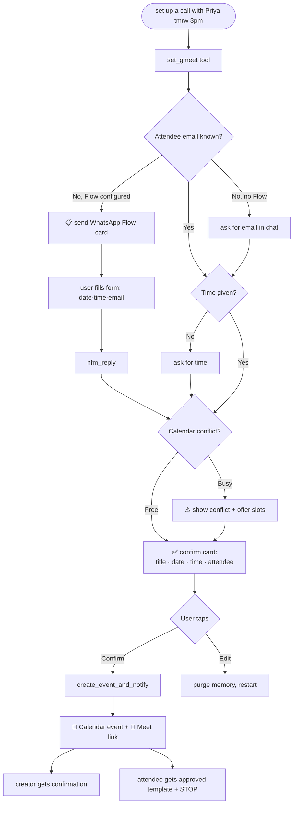
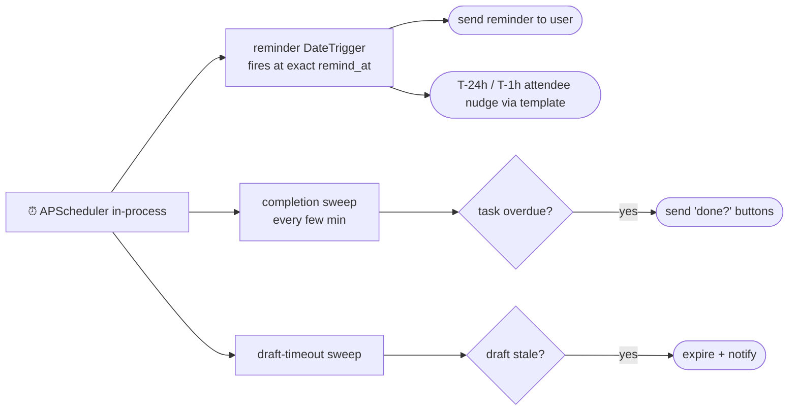
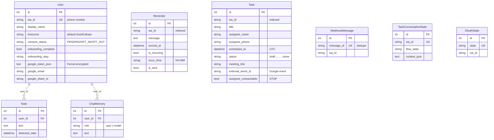
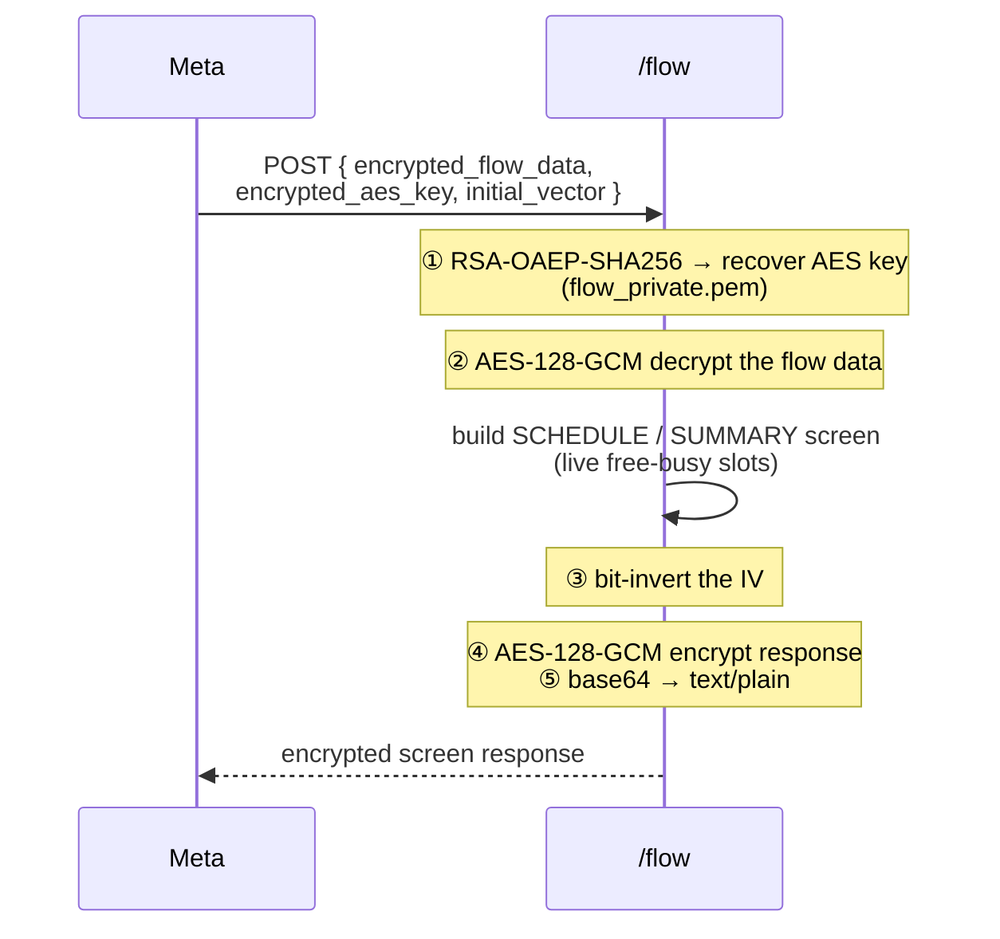

<div align="center">

# 🗓️ araka

### A purpose-built WhatsApp scheduling assistant

Books Google Meet calls · tracks tasks, reminders & notes · coordinates with the *other* person — all from a chat thread.

`Flask` · `Sarvam 105b` · `Google Calendar/Meet/Gmail` · `WhatsApp Cloud API` · `SQLite WAL` · `APScheduler` · `Caddy` · `Oracle Cloud`

📖 **Prefer a rendered page?** Open [`explain.html`](explain.html) in a browser for the same content with live diagrams.

</div>

---

## 📑 Table of Contents

1. [What it is](#-what-it-is) · [Why it's different](#-why-its-different)
2. [System architecture](#-system-architecture)
3. [How a message travels](#-how-a-message-travels)
4. [Onboarding](#-onboarding) · [Meeting booking](#-meeting-booking) · [Reminders](#-reminder-engine)
5. [Data model](#-data-model)
6. [WhatsApp Flow encryption](#-whatsapp-flow-encryption)
7. [Codebase map](#-codebase-map) · [Tool reference](#-tool-reference)
8. [Configuration](#-configuration) · [Quick start](#-quick-start) · [Deploy](#-deploy)
9. [Docs](#-key-documents) · [Pending work](#-pending-from-audit)

---

## 🎯 What it is

araka lives inside WhatsApp. You text it like a friend — *"set up a call with Priya tomorrow at 3"* — and it resolves the contact, checks your calendar for conflicts, asks you to confirm, creates a **Google Meet**, and then **messages Priya too** with the details (via an approved template she can opt out of).

It also keeps personal notes, one-time & recurring reminders, a to-do list, and can answer questions about your Gmail and calendar.

> **🔑 Tech note — the trust model.** The LLM never books, cancels, or invents a time on its own. Deterministic guards sit *between* the model and any irreversible action: a **confirmation gate** (nothing is created until you tap *Confirm*), an **anti-hallucination time check** (the server rejects any clock time the user didn't actually type), and a **field accumulator** that asks one question at a time. This is what separates a reliable scheduling utility from a chatbot that occasionally lies about having booked something.

## 🆚 Why it's different

| | Most AI assistants | **araka** |
|---|---|---|
| Scope | Open-ended, "ask me anything" | One job: **schedule + remind, reliably** |
| Channel | iMessage / web / app | **WhatsApp-native** (official Cloud API) |
| Who it acts for | Just you | **Both sides** — notifies & reminds the attendee too |
| Behaviour | Autonomous, decides its own steps | **Deterministic, guard-railed, auditable** |
| Meta 2026 policy | General chatbots **banned** | Scheduling utility = **allowed lane** ✅ |

> **🔑 Tech note — bilateral coordination.** When you book with someone, araka contacts *them* too — but only through a Meta-approved **utility template**, and it honours `STOP`. If the attendee opts out, the task is flagged `assignee_unreachable` and araka stops messaging them. This is the feature single-player assistants structurally can't offer on a compliant channel.

---

## 🏗️ System architecture



> **🔑 Tech note — why a single worker.** gunicorn runs with `-w 1` *on purpose*. The reminder scheduler (APScheduler) lives **in-process**; a second worker would duplicate every job and double-fire reminders. Concurrency comes from one background asyncio loop running on a thread, not from multiple workers. Scaling past this means externalising the scheduler — deliberately deferred until revenue demands it.

---

## 📨 How a message travels



> **🔑 Tech note — ack first, work later.** The webhook returns `200` almost immediately and processing happens fire-and-forget. If araka returned errors, Meta would retry and double-process. Idempotency is enforced by a unique index on `webhook_messages.message_id` — the same delivery is never handled twice.

**Routes** (`bot/main.py`): `GET /` · `GET /health` · `GET/POST /webhook` · `GET /auth/callback` · `POST /flow`

---

## 👋 Onboarding

Three questions, asked one at a time, never re-asked — then a transparent consent step.



> **🔑 Tech note — consent is informed, not buried.** The final screen spells out exactly what Google access is used for (calendar, meet, contacts; gmail only when asked), states data is never sold or used to train AI, and links the full Terms & Privacy *before* the user taps **Connect Google**. Google is offered, not forced — notes/reminders/to-dos work without it. State lives in `User.onboarding_step`; `User.onboarding_complete` gates the rest of the bot.

---

## 🤝 Meeting booking



> **🔑 Tech note — two ways in.** When the attendee's email is unknown, araka can either ask in chat *or* pop a **native WhatsApp Flow** form (date picker + time dropdown + email). The Flow can be static (client-side) or **dynamic** — an encrypted `/flow` endpoint that returns *live* free/busy slots from the user's calendar. Editing purges the last few `ChatMemory` rows so the LLM never sees a half-finished booking and wrongly claims "I've scheduled it."

---

## ⏰ Reminder engine



> **🔑 Tech note — precision + restart-safety.** Reminders use APScheduler `DateTrigger` for ±1s accuracy. Because in-process jobs are lost on crash, a reconcile sweep on boot re-reads the DB and re-arms anything pending — so a restart never silently drops a reminder.

---

## 🗄️ Data model



> **🔑 Tech note — keyed by phone, not relational FK.** Only `Note` and `ChatMemory` join to `users.id`. `Reminder`, `Task`, `TaskConversationState`, `OAuthState` and `WebhookMessage` are keyed directly by the **`wa_id` string** (the phone number). This keeps the per-user hot path a single indexed lookup with no joins. Every hot column (`wa_id`, `message_id`, `status`, `assignee_id`, `remind_at`) is indexed. **To-dos are *not* in SQLite** — they live in a per-user **Google Sheet** (three tabs), written via `sheets.py`.

---

## 🔐 WhatsApp Flow encryption

The dynamic `/flow` endpoint speaks Meta's end-to-end encryption scheme so live calendar slots can be served inside the form.



> **🔑 Tech note — the bit-inverted IV.** Meta requires the **response** to be encrypted with the request's IV *bitwise-inverted* (each byte XOR `0xFF`), reusing the same AES key. Get this wrong and the Flow shows a generic error with no diagnostics. The private key (`flow_private.pem`, `chmod 600`) is the single secret that decrypts all Flow traffic and is excluded from backups.

---

## 🗂️ Codebase map

```
bot/
├── main.py                  Flask app · webhook entry · scheduler boot · routes
├── agent.py                 AI loop — Sarvam 105b + 19 tools + 20-msg memory
├── config.py                every env var in one place + validate()
├── database.py              SQLAlchemy models + SQLite WAL pragmas
├── tools.py                 19 tool functions the LLM can call
│
├── handlers/
│   └── callback_handler.py  routes button / list / Flow-reply (nfm_reply)
│
├── services/
│   ├── whatsapp.py          send_message · buttons · list · flow · templates
│   ├── onboarding.py        3-step setup + transparent consent screen
│   ├── google_auth.py       OAuth paste-flow · Fernet token encrypt/decrypt
│   ├── calendar.py          create / get / delete / update events · day_busy()
│   ├── gmeet_flow.py        WhatsApp-Flow booking path (send + complete)
│   ├── flow_endpoint.py     RSA-OAEP + AES-128-GCM /flow endpoint
│   ├── gmail.py             Gmail search/read (readonly) + send_email (gmail.send)
│   ├── contacts.py          Google Contacts search
│   ├── reminder_scheduler.py APScheduler job registration
│   ├── task_service.py      task lifecycle · conversation state · datetime parse
│   ├── transcribe.py        Groq Whisper voice→text
│   ├── sheets.py            per-user Google Sheet (notes/todos tabs)
│   └── phone.py             E.164 normalisation
│
└── utils/
    ├── time.py              IST/UTC helpers · now() · ISO parsing
    └── intent.py            extract_meeting_datetime · has_explicit_clock_time

setup/    .env.example · systemd unit · secret + RSA-key generators · flows/*.json
tester/   run_tests.sh · harness (sim) · 11 end-to-end scenarios
Document/ deploy · flows · templates · privacy · terms · audit
```

---

## 🛠️ Tool reference

19 functions the agent can call (`bot/tools.py`, declared in `bot/agent.py`):

| Category | Tools |
|---|---|
| 🤝 **Scheduling** | `set_gmeet` — book a meeting with someone (Meet link + bilateral notify) |
| 📅 **Calendar** | `calendar_create` · `calendar_get_all` · `calendar_cancel` *(query / `cancel_all` / pick-list)* · `calendar_reschedule` |
| ➕ **Add a guest** | `calendar_add_attendee` — add someone to a meeting that **already exists** (never creates one) |
| 👤 **People** | `contacts_search` — look up a saved contact's email/phone |
| 📧 **Email (read)** | `gmail_search` — search & read Gmail (read-only) |
| ✉️ **Email (send)** | `compose_email` — *opens* the email Flow form; user types & sends from their own Gmail |
| 📝 **Notes** | `save_note` · `get_notes` · `delete_note` |
| ⏰ **Reminders** | `set_reminder` · `list_reminders` · `delete_reminder` |
| ✅ **To-dos** | `add_todo` · `get_todos` · `complete_todo` · `delete_todo` *(stored in Google Sheets)* |

> **🔑 Tech note — `compose_email` keeps the AI out of the content.** Sending mail is a deliberate non-LLM path: `compose_email` only *opens* a WhatsApp Flow form. The user types To/Subject/Body and on submit it goes **Flow → `gmail.send` → Gmail** with no model in the loop — the AI never reads or writes the email. If no Flow is configured the tool reports unavailable instead of drafting in chat. See [`Document/EMAIL_FLOW_SETUP.md`](Document/EMAIL_FLOW_SETUP.md).

> **🔑 Tech note — Sarvam quirk handling.** Sarvam 105b occasionally emits an empty-string argument key in a tool call. `agent.py` hardens against this by filtering every call's args against the real function signature via `inspect.signature` before dispatch — junk keys are dropped instead of crashing the tool.

---

## ⚙️ Configuration

Full list in [`setup/.env.example`](setup/.env.example). The ones that matter:

| Variable | Purpose |
|---|---|
| `WA_PHONE_NUMBER_ID` · `WA_ACCESS_TOKEN` | WhatsApp Business identity |
| `WA_APP_SECRET` + `REQUIRE_WA_SIGNATURE` | Webhook HMAC signature (fail-closed) |
| `WA_MEETING_TEMPLATE_NAME` | Approved attendee-notification template |
| `SARVAM_API_KEY` · `SARVAM_MODEL` | Chat brain (`sarvam-105b`) |
| `GROQ_API_KEY` | Voice transcription (Whisper) |
| `GOOGLE_CREDENTIALS_FILE` | OAuth client JSON |
| `GOOGLE_TOKEN_ENCRYPTION_KEY` | **Fernet** key — encrypts stored Google tokens |
| `WA_GMEET_FLOW_ID` | Meeting Flow ID (empty ⇒ plain text prompts) |
| `WA_EMAIL_FLOW_ID` | Email Flow ID (empty ⇒ send-email feature off) |
| `FLOW_PRIVATE_KEY_PATH` + `WA_FLOW_DRAFT_MODE` | RSA key for `/flow`; draft mode for pre-publish testing |
| `DATABASE_URL` · `BASE_URL` | SQLite path · public HTTPS base |

**Google scopes:** `calendar` · `spreadsheets` · `contacts.readonly` · `gmail.readonly` · `gmail.send`

---

## 🚀 Quick start

```bash
# 1 · deps
python -m venv venv && source venv/bin/activate
pip install -r requirements.txt

# 2 · env
cp setup/.env.example .env            # fill in values
python setup/generate_secrets.py      # → GOOGLE_TOKEN_ENCRYPTION_KEY + FLASK_SECRET

# 3 · run
bash setup/run_local.sh

# 4 · test (no live APIs — fully mocked)
bash tester/run_tests.sh              # 11 scenarios
```

## ☁️ Deploy

Full walkthrough: [`Document/ORACLE_DEPLOY.md`](Document/ORACLE_DEPLOY.md).

```bash
# on the VM
sudo apt install -y python3-pip caddy
git clone <repo> ~/followup-bot && cd ~/followup-bot
cp setup/.env.example .env            # fill values; then chmod 600 .env
sudo cp setup/followup-bot.service /etc/systemd/system/
sudo systemctl enable --now followup-bot
# Caddy reverse-proxies 443 → 127.0.0.1:5000
# public host: 140-245-193-44.sslip.io  (auto-TLS)
```

---

## 📚 Key documents

| Doc | Contents |
|---|---|
| [`Document/CONTEXT.md`](Document/CONTEXT.md) | Canonical current-state reference (start here) |
| [`Document/audit.md`](Document/audit.md) | Meta-policy compliance · security · latency audit |
| [`Document/ORACLE_DEPLOY.md`](Document/ORACLE_DEPLOY.md) | Ubuntu VM + Caddy + systemd setup |
| [`Document/FLOW_ENDPOINT_SETUP.md`](Document/FLOW_ENDPOINT_SETUP.md) | RSA key-gen + Meta upload + `/flow` wiring |
| [`Document/EMAIL_FLOW_SETUP.md`](Document/EMAIL_FLOW_SETUP.md) | Send-email-from-chat Flow + `gmail.send` scope |
| [`Document/META_TEMPLATE_SETUP.md`](Document/META_TEMPLATE_SETUP.md) | Webhook setup + `gmeet_confirmation` assignee template |
| [`Document/DB_BACKUP_RESTORE.md`](Document/DB_BACKUP_RESTORE.md) | Backup mechanics + restore procedure |
| [`Document/PRIVACY_POLICY.md`](Document/PRIVACY_POLICY.md) · [`TERMS_AND_CONDITIONS.md`](Document/TERMS_AND_CONDITIONS.md) | Published legal docs |
| [`Document/TESTER_README.md`](Document/TESTER_README.md) | Run & extend the test suite |

---

## 📋 Pending (from audit)

**P0** &nbsp;`▢` Business Verification (unblocks Flow publish) &nbsp;·&nbsp; `▢` rotate Sarvam key &nbsp;·&nbsp; `▢` `chmod 600 .env` &nbsp;·&nbsp; `▢` per-user rate limiting &nbsp;·&nbsp; `▢` soften AI-as-product wording

**P1** &nbsp;`▢` encrypt PII columns at rest &nbsp;·&nbsp; `▢` process `messages.statuses` webhook &nbsp;·&nbsp; `▢` ack-before-process + async LLM client &nbsp;·&nbsp; `▢` confirm template is UTILITY category &nbsp;·&nbsp; `▢` set `TERMS_URL` once T&C is published

<div align="center">

---

*araka — reliable scheduling, on the channel people already use.*

</div>
