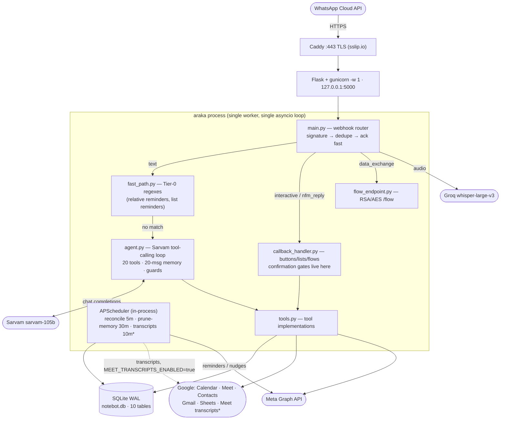
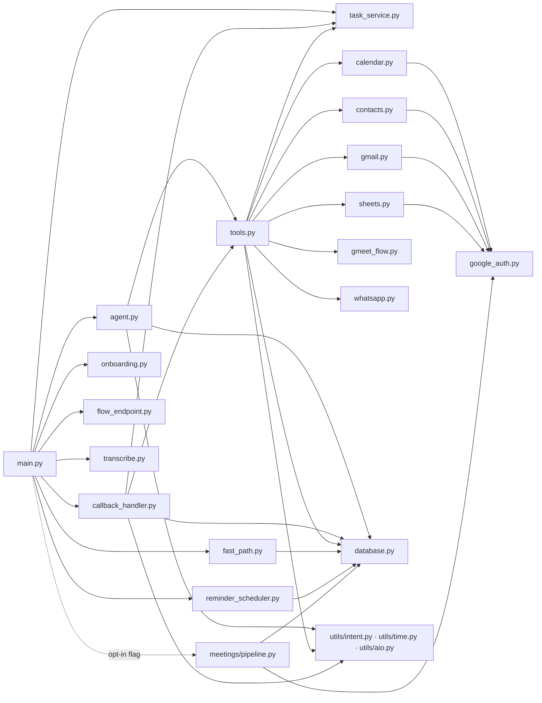
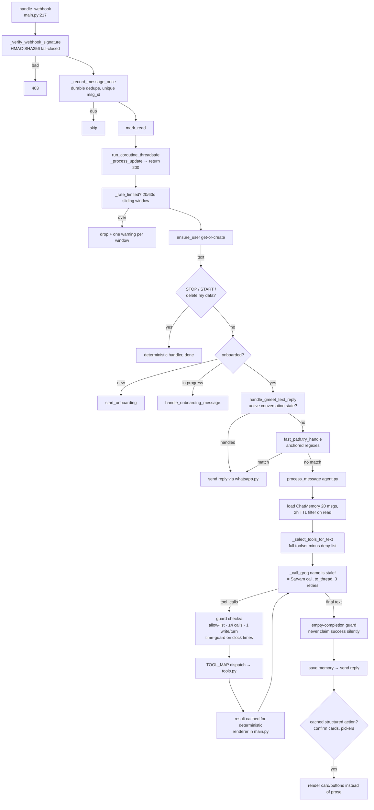
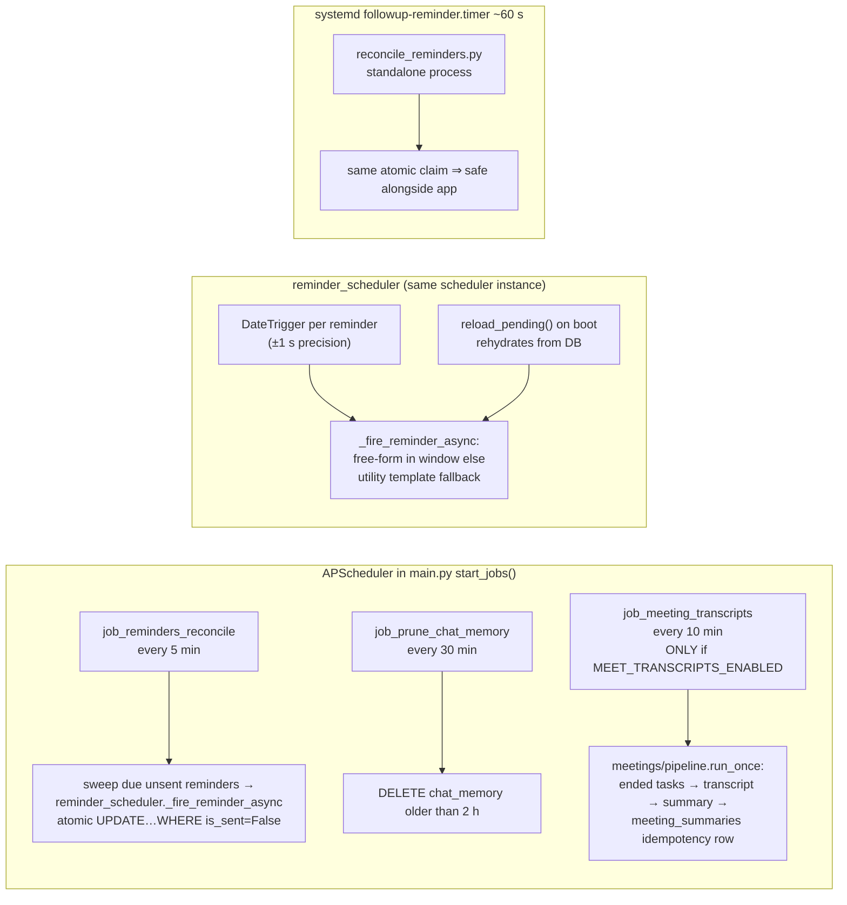
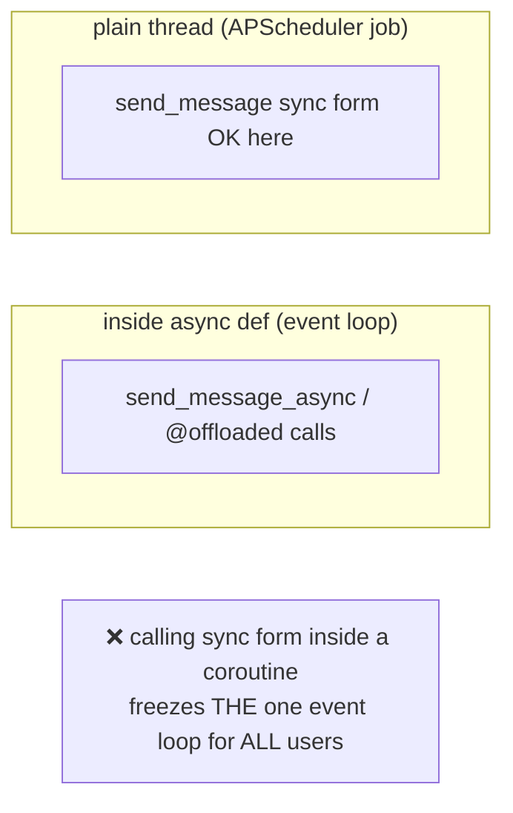
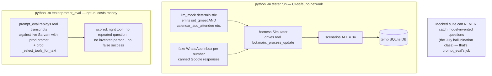

# araka — Architecture & function graphs

*Verified against code 2026-08-23. All graphs are Mermaid.*

## 1. System architecture



**Why one worker:** APScheduler lives in-process; a second gunicorn worker would double-fire every reminder. Concurrency comes from the background asyncio loop (`main.py` boots it on a thread) with blocking calls offloaded to worker threads (`bot/utils/aio.py`, `asyncio.to_thread` in `agent.py`/`transcribe.py`).

## 2. Codebase map

```
bot/
├── main.py                     Flask app: routes, signature check, dedupe,
│                               rate limit, message router, scheduler boot
├── agent.py                    Sarvam loop: SYSTEM_PROMPT, TOOLS (20),
│                               TOOL_MAP, guard state, memory, JSON-leak recovery
├── config.py                   every env var + validate() + Google scopes
├── database.py                 10 SQLAlchemy models + migration runner + WAL pragmas
├── tools.py                    the 20 tool bodies (+2 internal-only:
│                               calendar_delete/calendar_update)
├── handlers/
│   └── callback_handler.py     interactive router + gmeet/add-guest/reschedule/
│                               email flow state machines + confirmation executors
└── services/
    ├── fast_path.py            Tier-0 anchored regexes (bypass LLM)
    ├── whatsapp.py             Meta Graph client: sync + _async senders,
    │                           templates, flows, media download
    ├── onboarding.py           await_wa_confirm→await_name→await_tz→consent
    ├── google_auth.py          OAuth paste-flow, Fernet token crypto, disconnect
    ├── calendar.py             CRUD, Meet link, day_busy(), free-slot finder
    ├── contacts.py             People API + otherContacts over contacts_cache
    ├── gmail.py                search/read + send_email
    ├── sheets.py               per-user todo Sheet (3 tabs)
    ├── gmeet_flow.py           booking pipeline: resolve→conflicts→create+notify
    ├── task_service.py         Task lifecycle, conversation state store,
    │                           datetime parsing, gmeet slot cache
    ├── reminder_scheduler.py   DateTrigger jobs, atomic claim, reload_pending()
    ├── flow_endpoint.py        RSA-OAEP-SHA256 unwrap + AES-128-GCM (+IV flip)
    ├── transcribe.py           Groq Whisper voice→text (60 s timeout)
    └── meetings/               transcript→summary pipeline (opt-in)
        ├── pipeline.py         run_once(): ended tasks → fetch → summarise → row
        ├── transcript_source.py provider-agnostic contract
        ├── meet_source.py      Meet REST v2 (Workspace-tier only)
        ├── zoom_source.py      VTT parser tested; fetch unimplemented
        └── summariser.py       TranscriptContext → MeetingSummary via LLM
bot/utils/
    ├── time.py                 IST/UTC, ISO parse, AM/PM disambiguation
    ├── intent.py               has_explicit_clock_time() — THE anti-hallucination guard
    └── aio.py                  @offloaded decorator
root:
    reconcile_reminders.py      standalone 1-shot heartbeat (systemd timer)
setup/                          .env.example, systemd units, key generators,
                                backup.sh, flows/*.json (source of record only)
tester/                         harness + llm_mock + scenarios.ALL = 34 + prompt_eval
Document/                       older docs (see context/DOC_ISSUES.md for drift)
context/                        this folder
```

## 3. Module dependency graph



## 4. Function graph — inbound text turn



## 5. Function graph — interactive/button turn

```mermaid
flowchart TD
    A[type=interactive or button] --> B[handle_interactive_reply<br/>callback_handler.py:68]
    B --> C{route by reply_id prefix}
    C -->|connect_google / disconnect_google| D[google_auth handle_connect/_disconnect]
    C -->|show_capabilities / show_terms / show_privacy| E[deterministic info cards]
    C -->|gmeet_confirm_*| F["_handle_gmeet_confirm<br/>(executes create_event_and_notify)"]
    C -->|calendar_reschedule_confirm_*| G[_handle_calendar_reschedule_confirm]
    C -->|add_attendee_confirm_*| H[_handle_add_attendee_confirm]
    C -->|add_attendee_contact_* / add_attendee_event_*| I[pickers]
    C -->|gmeet_contact_*| J[_handle_gmeet_contact_choice]
    C -->|conflict_*| K[_handle_conflict slot offers]
    C -->|meeting_add_calendar\|link / meeting_decline| L[attendee template quick-replies]
    C -->|onboard_*| M[onboarding steps]
    C -->|cancel_flow| N[purge state + recent memory]
    C -->|unknown| O["unknown action. try again."]
    F & G & H --> P[clear task_conversation_state<br/>send confirmations]
```

## 6. Background jobs (actual, verified)



> Removed features that old docs still mention: `job_check_drafts`, `job_check_unconfirmed`, `job_completion_checks`, `job_task_reminders`, and automatic T-24h/T-1h attendee nudges **no longer exist** (vestigial columns remain on `tasks`; see CODEBASE note in DOC_ISSUES.md).

## 7. Sync-vs-async rule (the #1 way to break this app)

Every WhatsApp send and every Google call has two forms:



- `whatsapp.py` exposes both `send_message` and `send_message_async`.
- `calendar.py`/`gmail.py` wrap blocking Google calls with `@offloaded`.
- `sheets.py` routes each request through `_run(...)`.
- Sarvam + Whisper calls go through `asyncio.to_thread`.

## 8. Testing architecture


