# araka — Data model

*Verified against `bot/database.py` 2026-08-23. There are **10 tables** (older docs say 9 — they miss `meeting_summaries`).*

## 1. ERD

```mermaid
erDiagram
    users ||--o{ notes : "user_id FK"
    users ||--o{ chat_memory : "user_id FK"
    users ||--o{ contacts_cache : "user_id FK"
    tasks ||--o| meeting_summaries : "task_id UK (idempotency)"

    users {
        int id PK
        string wa_id UK "phone number"
        string display_name
        string timezone "default Asia/Kolkata"
        string consent_status "PENDING/OPT_IN/OPT_OUT"
        datetime consent_given_at
        bool onboarding_complete
        string onboarding_step "await_wa_confirm/await_name/await_tz/cleared when done"
        text google_token_json "Fernet-encrypted"
        string google_email
        string google_sheet_id
    }
    notes {
        int id PK
        int user_id FK
        text text
        datetime detected_date
    }
    chat_memory {
        int id PK
        int user_id FK
        string role "user | model"
        text text
        datetime created_at "2h TTL, pruned by job + filtered on read"
    }
    contacts_cache {
        int id PK
        int user_id FK
        string name
        string name_lower "indexed lookup"
        string email "Fernet-encrypted"
        string phone "Fernet-encrypted"
        string source "contacts | other_contacts"
    }
    webhook_messages {
        int id PK
        string message_id UK "durable dedupe"
        string wa_id
        datetime created_at
    }
    meeting_summaries {
        int id PK
        int task_id UK "idempotency key — row exists ⇒ never redone"
        text summary_json "full MeetingSummary dataclass as JSON"
        datetime created_at
    }
    reminders {
        int id PK
        string wa_id "indexed, NOT a users FK"
        text message
        datetime remind_at "UTC, indexed"
        bool is_recurring
        string recur_time "HH:MM for daily"
        bool is_sent "atomic claim flag"
    }
    tasks {
        int id PK
        string wa_id "booker, indexed"
        string title
        string assignee_name
        string assignee_phone
        int assignee_id "nullable users.id"
        bool assignee_unreachable "set on attendee STOP"
        datetime scheduled_at "UTC, indexed"
        string status "draft→scheduled→completed/rescheduled/cancelled/unconfirmed"
        string meeting_link
        string external_event_id "Google event id"
        string completion_response "VESTIGIAL"
        bool completion_check_sent "VESTIGIAL"
        bool reminder_1_sent "VESTIGIAL"
        bool reminder_2_sent "VESTIGIAL"
        string reminder_offsets_min "VESTIGIAL"
        int rescheduled_to_id "VESTIGIAL"
    }
    task_conversation_state {
        int id PK
        string wa_id UK "one active machine per user"
        string flow_state "e.g. awaiting_gmeet_confirmation"
        text context_json "flow_kind + gmeet_data + pickers"
    }
    oauth_states {
        int id PK
        string state UK
        string wa_id
    }
```

## 2. Keying strategy (deliberate)

- **FK to `users.id`:** only `notes`, `chat_memory`, `contacts_cache`.
- **Keyed directly by `wa_id` string:** `reminders`, `tasks`, `task_conversation_state`, `oauth_states`, `webhook_messages` — the hot path is a single indexed lookup with no joins.
- **To-dos are NOT in SQLite** — they live in a per-user **Google Sheet** (`sheets.py`, three tabs incl. a logging tab). `users.google_sheet_id` points at it.
- Vestigial `tasks` columns stay because dropping a column in SQLite means rebuilding the table — risk for no gain. Nothing reads them.

## 3. Encryption at rest

| Data | Protection |
|---|---|
| Google tokens (`google_token_json`) | Fernet via `GOOGLE_TOKEN_ENCRYPTION_KEY` |
| contacts_cache emails/phones | Fernet (same key) |
| Everything else (wa_id, names, notes, chat memory, task data) | **plaintext** — known open PII risk |

## 4. Lifecycle / wipe rules

| Event | Effect |
|---|---|
| `delete my data` | wipes notes, chat_memory, contacts_cache, task_conversation_state, oauth_states, reminders, tasks, User row |
| disconnect Google | revokes token, clears `google_token_json`/`google_email`, wipes contacts_cache |
| "refresh contacts" | wipes contacts_cache only (rebuilt from People API) |
| 24h TTL | chat_memory rows pruned by job every 30 min AND filtered on read |
| dedupe TTL | `WEBHOOK_DEDUPE_TTL_HOURS` (default 24) governs old webhook_messages cleanup |

## 5. Migrations

`database.py` includes a lightweight `_sync_migrate` runner that adds missing columns/indexes at boot (SQLite-specific DDL). Any new column must be added there too, or existing production DBs won't get it.
