# araka — Runtime flows

*Verified against code 2026-08-23. All diagrams are Mermaid. State names and button IDs are the literal strings in code.*

## 1. Webhook message lifecycle (every inbound event)

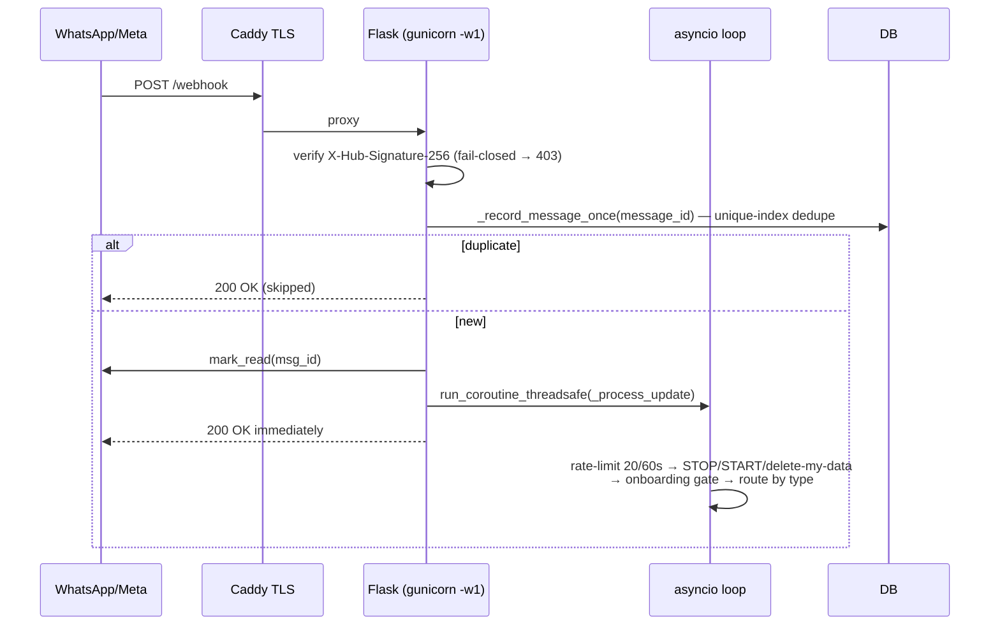

**Route table (`bot/main.py`):** `GET /` · `GET /health` · `GET /webhook` (Meta verify handshake) · `POST /webhook` · `GET /auth/callback` · `POST /flow`.

**Routing by type:** `text` → fast_path → agent · `audio` → Whisper → text path · `interactive` (button_reply/list_reply) → callback_handler · `nfm_reply` (Flow submit) → handle_flow_completion · `button` (template quick-replies) → callback_handler.

## 2. Onboarding (FR-1 state machine)

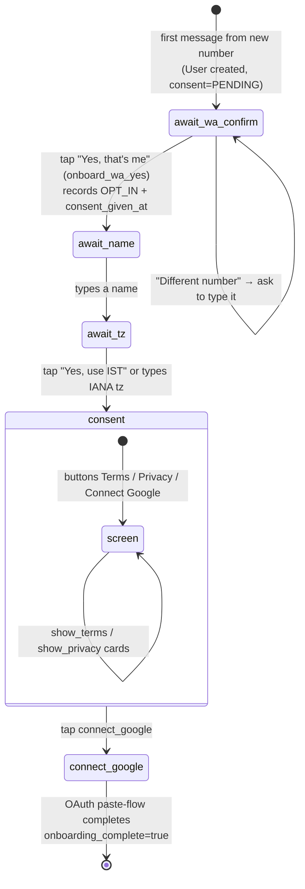

- Google is offered, not forced — notes/reminders/to-dos work without it.
- Until complete, ALL text feeds this machine; audio gets a "finish setup first" nudge.
- `onboard_tz_yes` / `onboard_tz_change` / `onboard_wa_yes` / `onboard_wa_other` are the literal button IDs.

## 3. Google OAuth (localhost paste-flow)

```mermaid
sequenceDiagram
    participant U as User (WhatsApp)
    participant B as araka
    participant G as Google

    U->>B: tap Connect Google
    B->>DB: create OAuthState(state, wa_id) — survives restarts
    B->>U: auth URL (user opens on phone/laptop)
    G->>U: consent screen (scopes incl. gmail.send, contacts.other.readonly;<br/>+ meetings.space.created only if MEET_TRANSCRIPTS_ENABLED)
    U->>B: taps "Connect Google" again with pasted code (or GET /auth/callback)
    B->>G: exchange code → tokens
    B->>DB: store google_token_json Fernet-encrypted (+google_email)<br/>mark onboarding_complete
```

Disconnect (`disconnect_google`) revokes + wipes token and contacts cache. `delete my data` wipes every user-scoped row (see DATA_MODEL).

## 4. Meeting booking — `set_gmeet` (the core flow)

```mermaid
flowchart TD
    A["user: 'set up a call with Priya tomorrow at 3'"] --> B[agent selects set_gmeet]
    B --> T{time-guard:<br/>has_explicit_clock_time?}
    T -->|model passed a time<br/>user never typed| TREJ[tool rejects — asks user]
    T -->|ok| C[resolve attendee via contacts_cache<br/>→ People API → otherContacts]

    C -->|multiple matches| P1[gmeet_contact_ list picker<br/>state=awaiting_gmeet_contact]
    C -->|no email known| E1{Flow configured?}
    E1 -->|yes WA_GMEET_FLOW_ID| FL[send_gmeet_flow card<br/>state=awaiting_gmeet_flow]
    E1 -->|no| E2[state=awaiting_gmeet_email<br/>ask in chat]
    C -->|email known| Q1{time given?}

    P1 --> RESOLVED
    FL -->|nfm_reply| FC[handle_gmeet_flow_completion] --> RESOLVED
    E2 -->|user types email| RESOLVED
    Q1 -->|no| QT[state=awaiting_gmeet_time ask] --> RESOLVED
    Q1 -->|yes| RESOLVED{conflict check<br/>calendar day_busy}

    RESOLVED -->|free| CC[confirm card gmeet_confirm_*<br/>title·date·time·attendee<br/>state=awaiting_gmeet_confirmation]
    RESOLVED -->|busy| CS[slot offers conflict_*<br/>state=awaiting_conflict_resolution] --> CC

    CC -->|"tap Confirm"| GO[gmeet_flow.create_event_and_notify]
    CC -->|"Edit / cancel_flow"| PURGE[purge recent ChatMemory rows<br/>clear conversation state]
    CS -->|pick slot| CC

    GO --> EV[Calendar event + Meet link<br/>Task status=scheduled external_event_id set]
    EV --> N1[creator: confirmation message]
    EV --> N2[attendee: utility template gmeet_confirmation<br/>{{1}}booker {{2}}title {{3}}datetime {{4}}link<br/>buttons meeting_add_calendar|link · meeting_decline<br/>respects assignee_unreachable STOP flag]
```

**Conversation states used by the booking machine** (`task_conversation_state.flow_state`, context JSON carries `flow_kind=gmeet` + `gmeet_data`):

| State | Meaning |
|---|---|
| `awaiting_gmeet_time` | need a start time |
| `awaiting_gmeet_email` | need attendee's email |
| `awaiting_gmeet_contact` | contact picker shown |
| `awaiting_gmeet_flow` | Flow form open |
| `awaiting_conflict_resolution` | slot picker after conflict |
| `awaiting_gmeet_confirmation` | confirm card shown |

Any active state short-circuits the LLM: `handle_gmeet_text_reply` runs BEFORE fast_path/agent so "3pm works" lands in the machine, not in chat.

## 5. Add guest to existing event — `calendar_add_attendee`

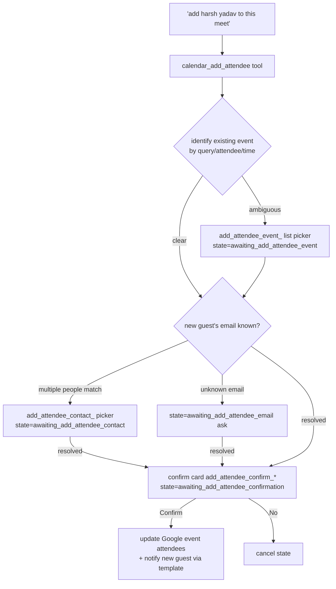

This flow exists because of the July hallucination incident: "add X" previously matched `set_gmeet` and the bot tried to book a NEW meeting. The tool description explicitly forbids that ("Never use set_gmeet to add someone to a meeting that already exists").

## 6. Reschedule & cancel

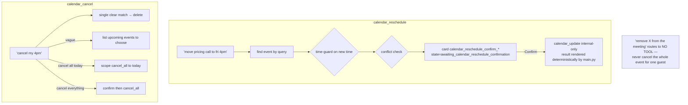

## 7. Reminders

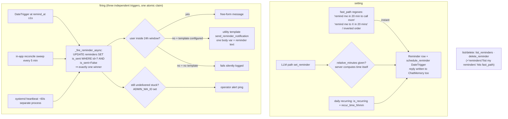

> Old docs mention automatic **T-24h/T-1h attendee nudges** and completion sweeps — those jobs were removed; only creator-requested reminders exist now.

## 8. Email — read vs send

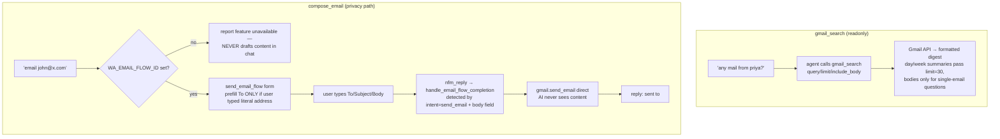

## 9. Dynamic Flow data-exchange (`POST /flow`) — crypto

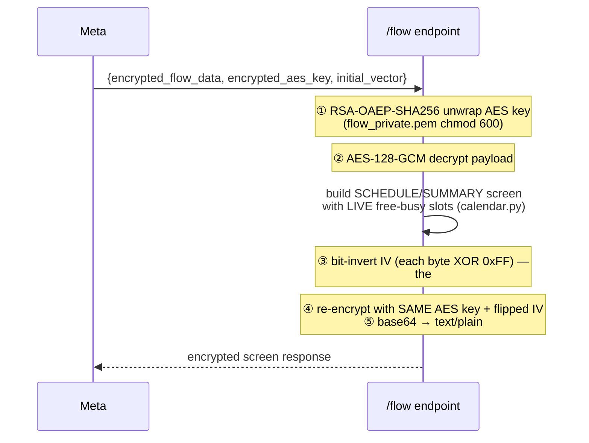

Enabled by `WA_GMEET_FLOW_DYNAMIC=true`; static form keeps working otherwise. Ping/health payloads handled per Meta spec; errors return encrypted error screens, not plaintext.

## 10. Voice notes

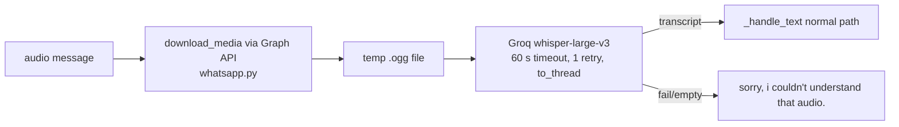

Groq key optional — feature degrades gracefully (`config.validate()` doesn't require it).

## 11. Transcript pipeline (opt-in)

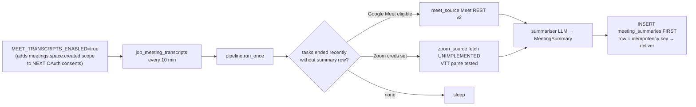

Free Gmail accounts can't generate Meet transcripts — hence default-off and Workspace-tier gating.

## 11b. Summary pull path ("what were the action items from that call?")

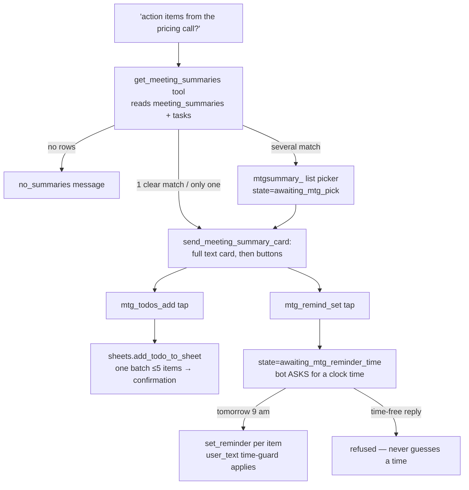

Rules baked in: the LLM never narrates or edits summaries (deterministic renderer); the card never steals an active booking's conversation slot; reminder times must come from the user's literal words (same anti-hallucination guard as everywhere else).

## 12. Consent & compliance flows

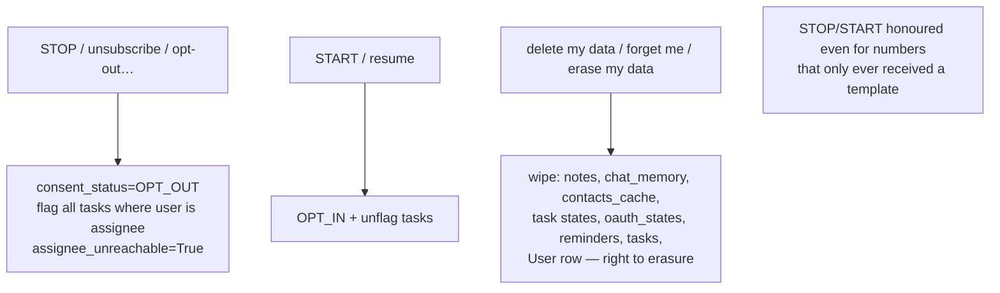
