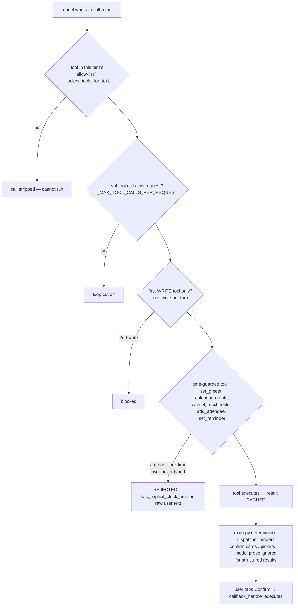

# araka — The trust model (guardrails)

*Why araka doesn't hallucinate bookings. Verified against code 2026-08-23.*

The LLM is treated as an untrusted proposer. Every path from "model said something" to "real-world change happened" passes through deterministic code.

## 1. The guard stack

## 2. Guard details

### 2.1 Anti-hallucination time check — `bot/utils/intent.py`
`has_explicit_clock_time()` scans the **user's literal message**. If the model passes `start_time_iso` containing a clock time the user didn't type, the tool rejects the call server-side. This kills the classic "LLM invents a convenient time" failure. *"araka's single most important safety function"* (CODEBASE_MAP) — do not touch without tests.

### 2.2 Confirmation gates
`set_gmeet`, `calendar_cancel`, `calendar_reschedule`, `calendar_add_attendee` all stop at a card with buttons (`gmeet_confirm_*`, `calendar_reschedule_confirm_*`, `add_attendee_confirm_*`, `conflict_*`). The tap — not the model — triggers `callback_handler`'s executor. Nothing irreversible happens from model text alone.

### 2.3 Tool scoping per turn
`_select_tools_for_text()` exposes a subset of the 19 tools matched to the message. Latency + safety win — but a request matching NO tool leaves the model cornered ⇒ improvisation ⇒ hallucination (the July incident). Rule: every new capability needs a routing branch; an unreachable tool is invisible.

### 2.4 Per-user agent lock
`_serialize_user_agent` locks per `wa_id` so one user's overlapping messages can't interleave turns of a booking.

### 2.5 Memory hygiene
- 20-message rolling window, 2 h TTL (prune job + read-time filter).
- Editing/aborting a flow purges recent memory rows so the LLM never sees half-finished state and claims success.
- Fast-path turns are still written to memory for coherent follow-ups.
- Failed-flow turns are purged so "I have scheduled" lies can't re-enter context.

### 2.6 Empty-completion guard
Sarvam sometimes returns empty content. It's never reported as `"done."` — false success claims are blocked.

### 2.7 Sarvam quirk hardening
Tool args are filtered against each function's real signature (`inspect.signature`) before dispatch — junk keys like empty-string arg names get dropped instead of crashing.

### 2.8 JSON-leak recovery
Sarvam occasionally emits a tool call as RAW JSON in content; `agent.py` detects and executes it properly instead of showing JSON to the user (tested by `scenario_tool_json_leak`).

### 2.9 Rate limit
Sliding window 20 msgs / 60 s per wa_id (`main.py:263`). One polite warning per window, then silent drop. In-memory — correct for `-w 1`.

## 3. The hallucination incident — case study (2026-07)

**Symptom:** "can we add harsh yadav in this meet as well?" → bot asked "which Mohit?" four times.

**Root cause chain:** routing matched "meet" → exposed only `set_gmeet` → its required fields (title/time) forced the model into booking mode → bare "hi" exposed zero tools → model regenerated its own last question from ChatMemory. Compounding bug: only `set_gmeet` results reached the renderer and the shared cache was *popped*, silently dropping other tools' confirm cards.

**Fixes shipped:** `calendar_add_attendee` (+routing+gate), dispatch-everything renderer, prompt rules 6–8 (never re-ask / current person is the subject / don't ask what the tool didn't ask for), capabilities section, remove-guest routes to no-tool, empty-completion guard, `prompt_eval` harness.

## 4. Rules for future changes

1. A missing tool IS a hallucination bug — add the capability or make the prompt decline explicitly.
2. A missing routing branch is the same bug — a tool that's never selected doesn't exist.
3. Structured results must reach the deterministic renderer; never pop shared caches.
4. Never let the sync WhatsApp/Google forms onto the event loop (see ARCHITECTURE §7).
5. Run `python -m tester.run` always; run `python -m tester.prompt_eval -n 3` before touching `SYSTEM_PROMPT`, tool declarations, or `_select_tools_for_text`. `~ FLAKY` = real signal.
